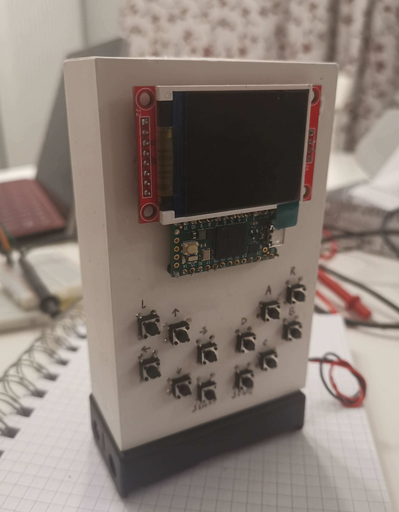

# Kit Ferret - Game device made with Teensy 4.0 and Rust

So, I've made game device!
It runs on a Teensy 4.0 and the firmware is written in Rust.
This is thanks to the [Teensy4-rs](https://github.com/mciantyre/teensy4-rs) project. The Library, Template and examples were essential for this project.

This project is not meant to be used in any other way than learning purposes.

## Features




### Hardware

#### Board

- ARM Cortex-M7 at 600 MHz
- 2MB of Flash memory
- 1MB of RAM memory

More info: <https://www.pjrc.com/store/teensy40.html>

#### Screen

- 160 x 128 resolution
- 16 bit color-depth (RGB 565)

More info: <https://www.displayfuture.com/Display/datasheet/controller/ST7735.pdf>

#### Misc

- 12 buttons (Directionals, A, B, C, D, Start, Select, R and L)

### Software

- Written in Rust
- 2D and 3D Support
- Vector and Pixel Shader Support
- Interlaced frames (only when running on an actual Teensy)
- Affine texture mapping, just like the original Playstation!


## Building and running

### On the Desktop

#### Building

Check the dependencies for [SDL2](https://github.com/Rust-SDL2/rust-sdl2).

#### Running

You need to have a SDL2.dll or SDL2.so in the PATH variable or copy it to the ```target/debug``` or ```target/release``` directory.
If you're using VSCode it should be as easy as running the project, otherwise you can run ```cargo run --release``` on the project root folder.

### On the Teensy

! TODO

## Acknowledgments

This project couldn't have been made if wasn't for these:

- <https://www.pjrc.com/store/teensy40.html> (Hardware and original C code)
- <https://github.com/mciantyre/teensy4-rs> (Library, Template, Example and Documenation)
- <https://trenki2.github.io/blog/2017/06/06/developing-a-software-renderer-part1/> (3D Renderer concepts and ported code)
- <https://github.com/sajattack/st7735-lcd-rs> (TFT screen driver)

## Why did I do this?

Game development always have been a area of interest for me, the problem with current tools and editors give too much options and barely any limitation. I don't want to make a commercial product from, I want to face a technical challenge, I want to understand how these things work on lower levels, I also want to do complex stuff in Rust.

I had to choose my battles, though: I didn't want to have to learn each command for the TFT screen or each math concept and optimization needed for a 3D renderer. Some code was ported, some libraries that did the basic were used.

## Why Kit-ferret?

No specific reason, I randomly picked an animal in a list generator and I found that baby ferrets are called "kits". Otherwise, this project would've been called Puppy-Dog, Kitten-Cat or Chick-Chicken. I'm a programmer and naming things are hard! I will let the marketing team deal with the PR.

## Known issues

- Certain combinations of button presses are registered wrongly due to no diodes being used
- Near-Plane clipping is not working properly
- Screen is not being updated using DMA
- Drawing Integer and Floats is not stabilized
